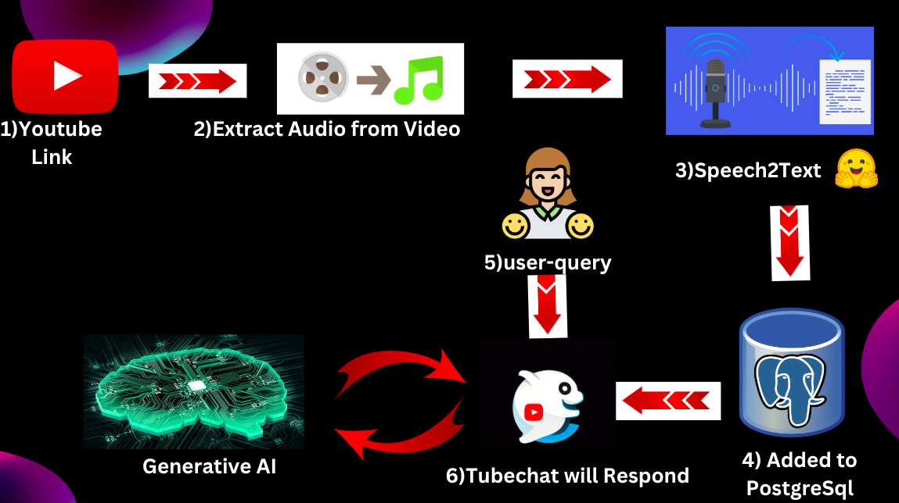

# Youtube Buddy

## How to run the project

1. Clone the repository
2. `cd frontend`
3. Run `yarn install` to install the dependencies
4. Run `yarn start` to start the project, Now the frontend will be running on `http://localhost:3000`
5. Go to `http://localhost:3000`
6. Download the Chrome extension from the top right corner of the page
7. Go to chrome://extensions/
8. Click on "Load unpacked"
9. Select the "dist" folder
10. Go to any youtube video and click on the extension icon to start interacting with the video

Youtube Buddy is a chrome extension that allows you to talk with youtube videos.

### Features

- Talk to youtube videos
- Watch video in Multilingual Languages

## Design Implementation 

### Frontend

### Backend

### Database

