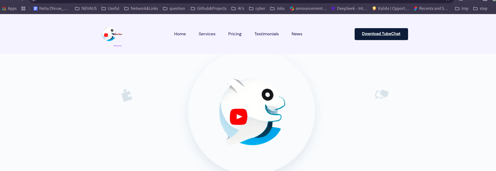
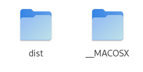
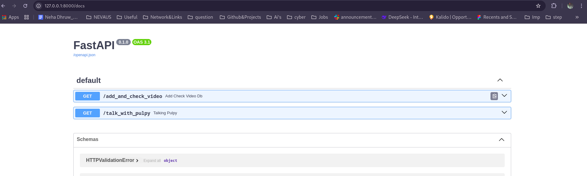
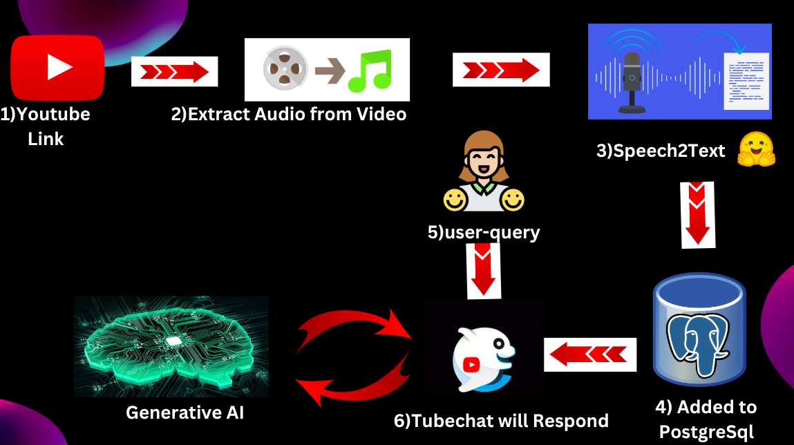

# Youtube Buddy

## How to run the project

1. Clone the repository
2. `cd frontend`
3. Run `yarn install` to install the dependencies
4. Run `yarn start` to start the project, Now the frontend will be running on `http://localhost:3000`
5. Go to `http://localhost:3000`
6. Download the Chrome extension from the top right corner of the page via clicking on download tubechat



7. Unzip the downloaded zip file(use the existing zip file) and open chrome and go to `chrome://extensions/`
8. Click on "Load unpacked"
9. Select the `dist` folder inside your unzipped tubechat-extension folder.



10. Now go to any youtube video and You must see the extension inserted in the youtube dom itself.


11. Now lets start the **backend server**, go to backend folder and run the following command


```bash
cd ..
cd backend
docker build -t tubechat .
docker run -d -p 8000:8000 tubechat

```
tubechat backend will be running on `http://localhost:8000`



12. Now we can talk on any youtube. Just visit any youtube video, a chat window will open, login in it 

Youtube Buddy is a chrome extension that allows you to talk with youtube videos.


### Features

- Talk to youtube videos
- Watch video in Multilingual Languages


## Design Implementation 

### Frontend

### Backend and Database

### Extension 


